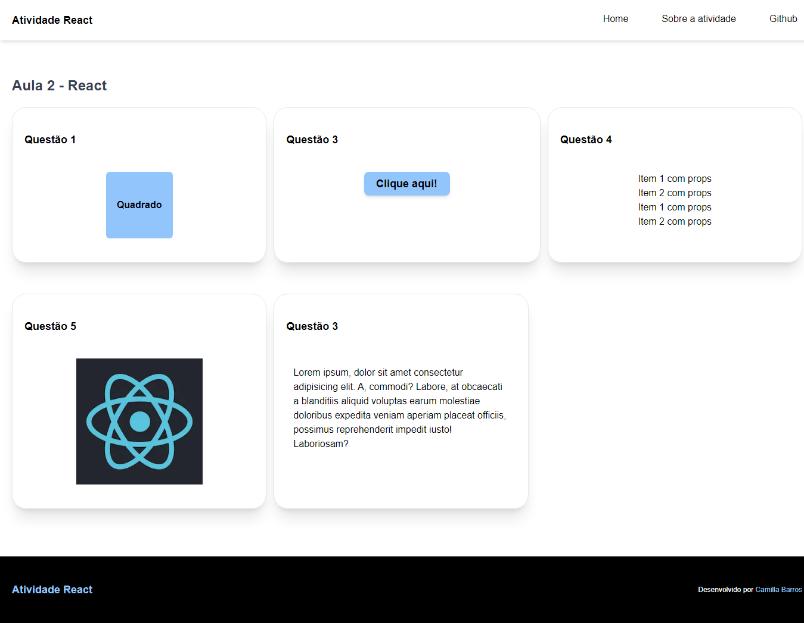
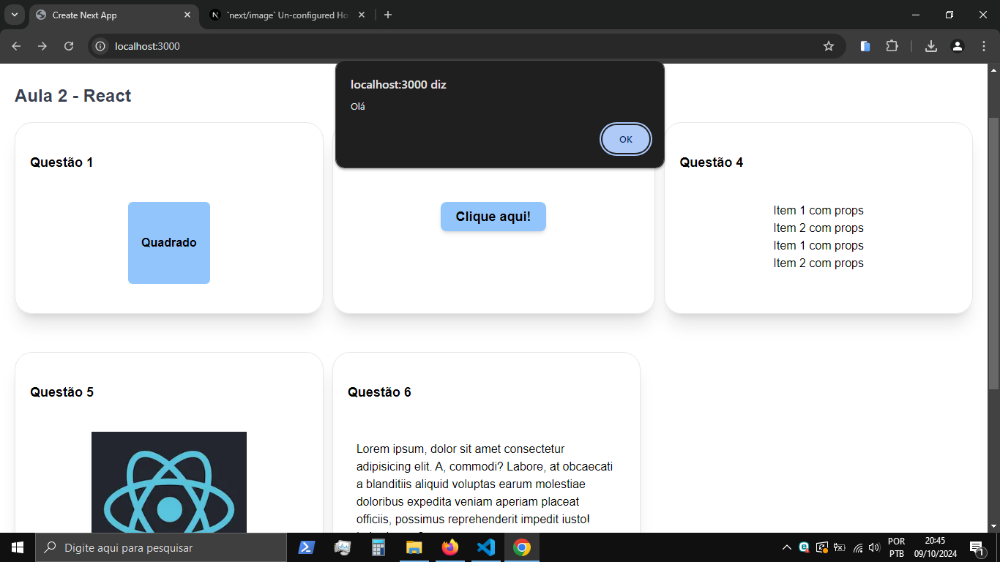

# Aula 2 - atividade React

Repositório com as respostas da atividade da aula 2 de React do Programa de Formação Acelerada - FAP da Softex Pernambuco.

## Visualize o Projeto

_Tela principal_


_funcionalidade do botão_


## Funcionalidades

- Click do botão: abre uma alert com a mensagem Olá no browser.

## Para rodar o projeto no seu computador:

- Para clonar o repositório:

```bash
  git clone hhttps://github.com/cabarros3/react-aula-2.git
```

- Instale as dependências:

```bash
  npm install
```

- Compile e Inicie o Projeto:

```bash
  npm run dev
```

## Tecnologias Utilizadas

- **HTML**: Estruturação da página.
- **CSS**: Estilização do layout e design responsivo.
- **TypeScript**: Lógica da aplicação e definição de tipos.
- **React**: biblioteca.
- **Next**: Ferramenta de build e desenvolvimento.

**_Entre em contato comigo_**

- **LinkedIn**: [Camilla Barros](https://www.linkedin.com/in/camillabarros/)
